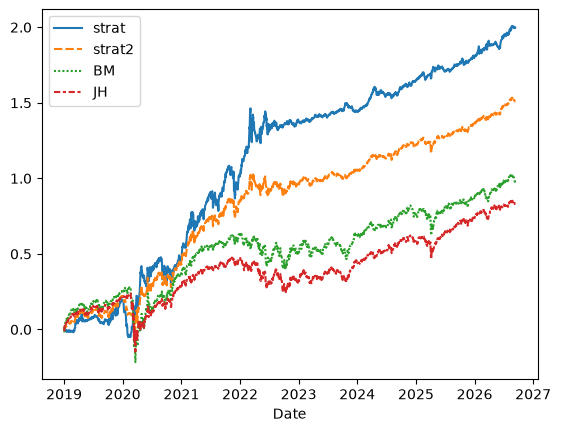

market-forecasting
=======

> Recreational quant research. I am not responsible for financial disasters resulting from using this repo.

## Abstract

Contemporary regime identification literature often neglects to confirm if observations hold and are actionable in out-of-sample periods. I developed a regime-identification algorithm using data on 16 macro-economic indicators available on january 1st 2019, which identified 4 unique economic regimes. I used statistical tests to assess performance of 40+ asset class ETFs during the 4 regime periods and used the results to develop two simple trading strategies. I then deployed the algorithm on post-2019 data where both trading strategies achieved superior returns (>150% return, sharpe > 1.18) to the benchmark equal-weighted S&P500 (98% return, sharpe = 0.65) and holding all assets classes equally (83% return, sharpe = 0.70).


> **Figure 1: Logarithmic returns over the forward-OOS backtesting period.** 
*strat = purely regime-based strategy; strat2 = 50% strat, 50% RSP portfolio; BM = benchmark, 100% RSP portfolio; JH = portfolio equally holding all asset classes.* 

## Installation

Clone the repo:
```
git clone https://github.com/sl9998/market-forecasting.git
cd market-forecasting
```

Make a venv:
```
python -m venv .venv
source .venv/bin/activate
```
(make sure to use this kernel in the notebooks)

Install dependencies:
```
python -m pip install -r requirements.txt
python -m pip install -e .
```

---

## Introduction & Purpose

Market macro-economic circumstances are [established](https://www.ssga.com/library-content/assets/pdf/global/pc/2025/decoding-market-regimes-with-machine-learning.pdf) to affect equity performance differently accross asset classes. While research conventionally succeeds in identifying regimes over historical periods, there is rarely any out-of-sample (OOS) testing to assess model performance on unseen market data. Additionally, clustering-based strategies suffer from strong look-ahead bias where the model is able to retroactively classify periods based on their relation to future circumstances. This would not be possible when deploying a "live" model.

This project aims to develop a robust market regime identification algorithm based on historical market and macro-economic data. Regime-based statistical tests will be used to identify best and worst asset performing asset classes per regime. Finally, a trading strategy will be developed based on the test results and validated OOS. This necessitates a biphasic approach where a model is first trained on a sample period and then deployed OOS without look-ahead bias. 

## Materials & Methods

### Data

The python [yfinance](https://pypi.org/project/yfinance/) package is used to fetch historical and live market data from [Yahoo! finance](https://finance.yahoo.com/) (yf). Extra-market data not readily available on yf is gathered from various sources (documented in the SOURCES.md file). Plans to utilize public APIs (like [the BoLS's](https://www.bls.gov/bls/api_features.htm)) to take this model live will be explored post semi-succesful backtest.

### Processing, PCA, clustering, backtesting, ...

Python files and notebooks contain detailed information on their respective methodology. 

### Statistical tests

By statistical testing, we want to identify if (1) **within equities** the return distributions differ **between regimes**, and (2) if **between equities** the return distributions differ **within regimes**. Note that all statistical testing informative for the eventual trading strategy is performed **only in training data!** We do not want data leakage informing us of the future "winning teams".

(1) is tested via the non-parametric **Kruskal-Wallis *H* test**, as financial returns data is fat-tailed and we cannot assume heteroscedasticity. In the case of a rejected null-hypothesis, a post-hoc comparison is needed to identify in which regimes distributions differ. For this, **Dunn's post-hoc test** is used.
Finally, a **simple linear regression based on the identified regime** is used to determine if expected returns meaningfully differ from 0 in any regimes, for any asset class.

In the case of (2), we are less interested in return distributions (as we assume different asset classes have different return distributions). Instead, we want to establish a difference in mean return. For this, we can use **Welch's ANOVA** which does not require equal variances. Despite violating the assumption of normal distribution, the results are still likely relevant.

## Results & Discussion

### Statistical tests

Extensive discussion of statistical test results is provided in the Notebook.

### Backtest

W.I.P.

## Limitations

### Clustering

- Clustering is done via a simple KMeans approach. This has poor(er) performance for identifying odd-shaped or -density clusters which may be present in our data. Additionally, clustering is not updated with new data and thus no novel clusters can be identified OOS.
- Although KMeans provides simplicity and usable results, clustering based on hidden markov models may have additional benefits and align more closely to [pre-existing research](https://www.mdpi.com/2227-7390/13/7/1128)

### Practical

- No transaction costs are accounted for during backtests
- As of yet, no system has been set up to retrieve live macro-economic data from a central database. Real-time implementation of this algorithm is currently out-of-scope.
